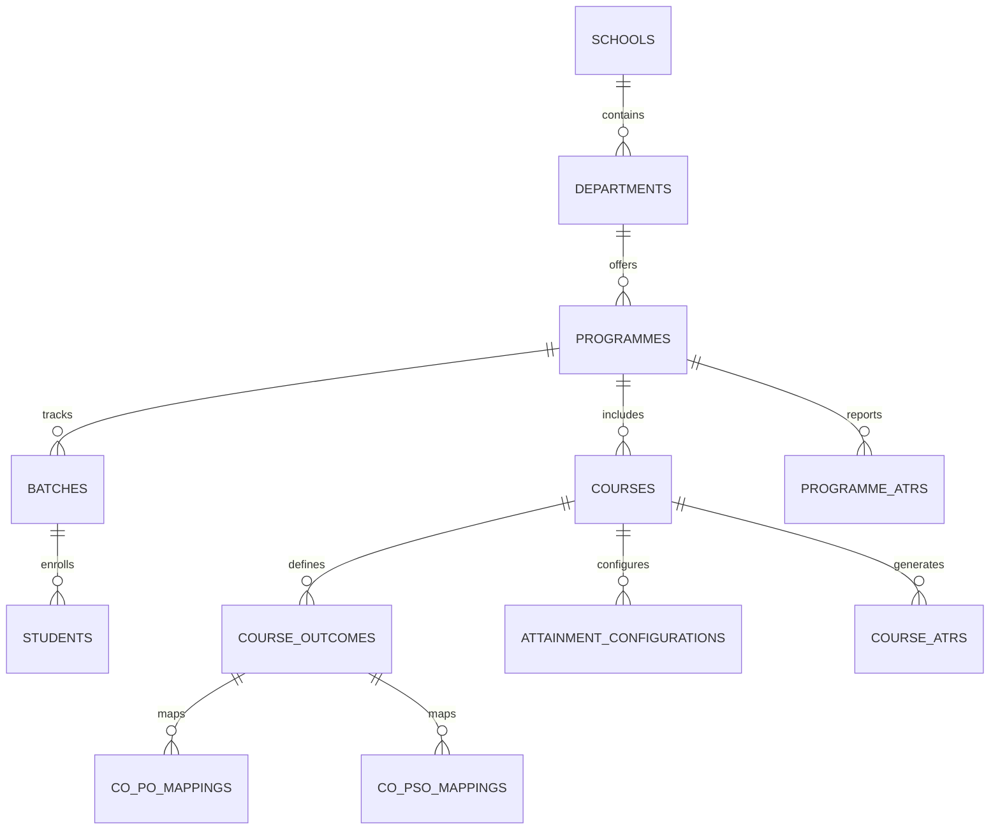

# Database Architecture & Flyway Migration Guide

## PostgreSQL Database Overview

The system is configured strictly for **PostgreSQL 14+ / 16+**. All schema objects, primary keys, foreign keys, unique constraints, check constraints, and performance indexes are managed via Flyway version controlled SQL migrations.

### Schema Relationships Diagram

## Flyway Migration Scripts Location

All migration scripts reside in:
`obe-backend/src/main/resources/db/migration/`

1. `V1__init_academic_and_user_schema.sql` — Schools, Departments, Programmes, Academic Years, Batches, Semesters, Courses, Students, Users.
2. `V2__init_outcomes_and_mapping_schema.sql` — PO, PSO, PEO, CO, CO-PO mapping matrix, CO-PSO mapping matrix, Targets.
3. `V3__init_assessment_and_config_schema.sql` — Attainment Configuration, Attainment Levels, End Sem Marks Uploads, Student CO Marks, Surveys.
4. `V4__init_attainment_engine_schema.sql` — Calculation Runs, Direct CO Attainments, Indirect CO Attainments, Overall CO Attainments, PO/PSO Attainments.
5. `V5__init_atr_and_approval_schema.sql` — Course ATRs, Programme ATRs, Approval Requests, Approval History.
6. `V6__seed_initial_master_data.sql` — Master seed data matching frontend initial context state.

## Naming & Execution Rules

- Version filenames follow pattern: `V<N>__<description>.sql`
- Never modify an already-applied Flyway script in production or shared environments.
- Always apply DDL modifications via new incremented version files (e.g. `V7__add_column.sql`).
